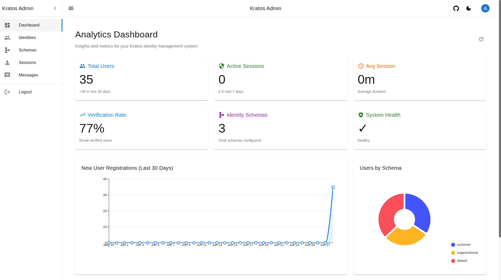
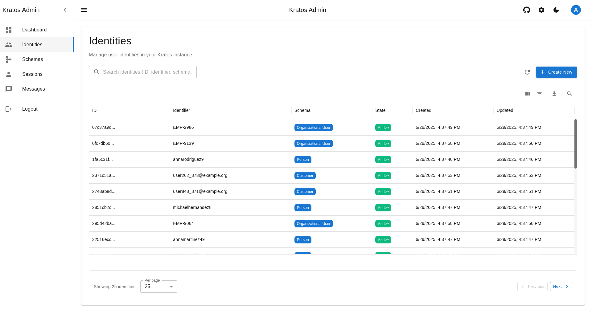
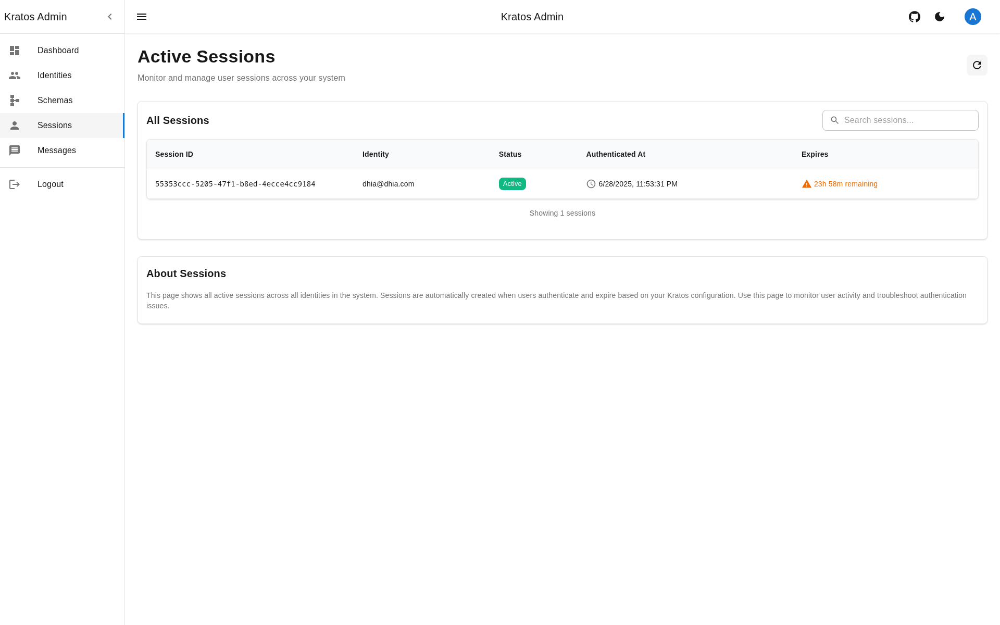
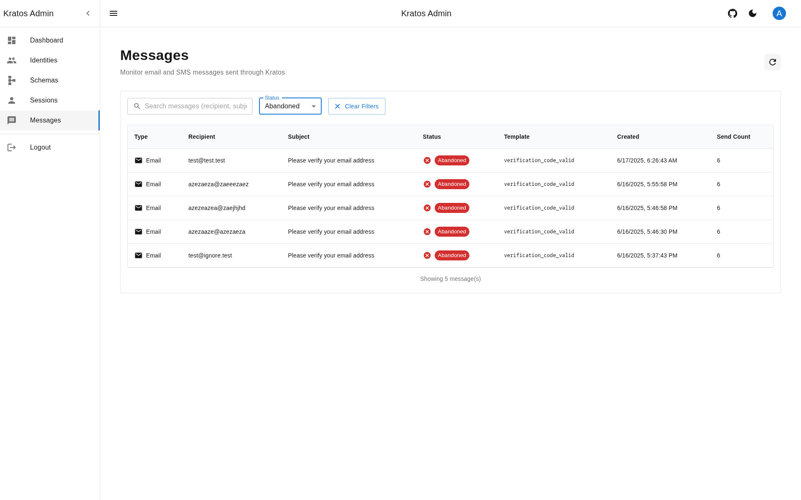
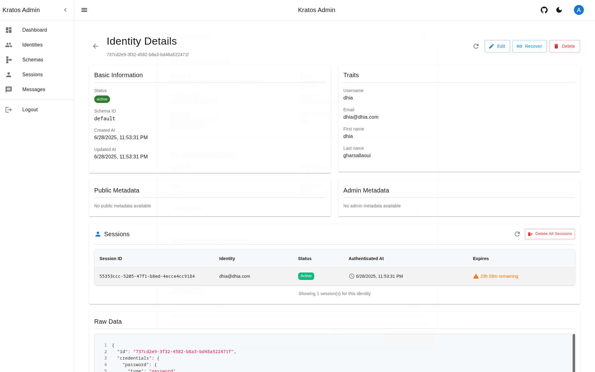
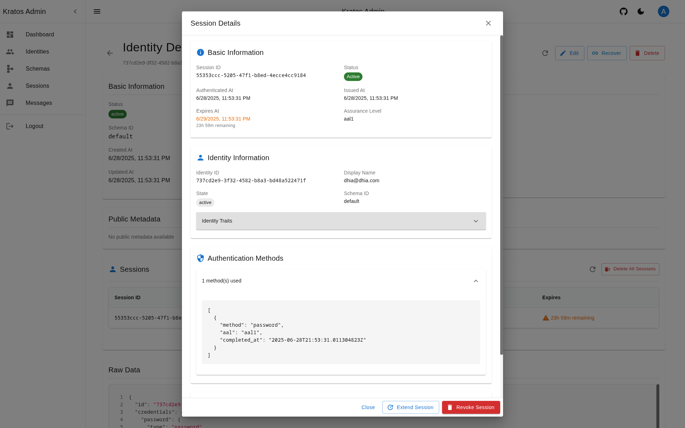
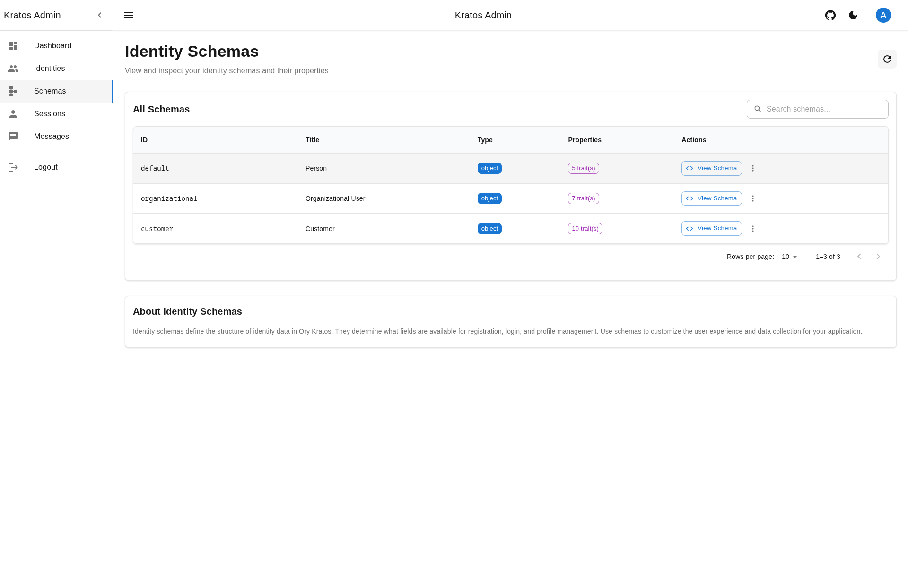
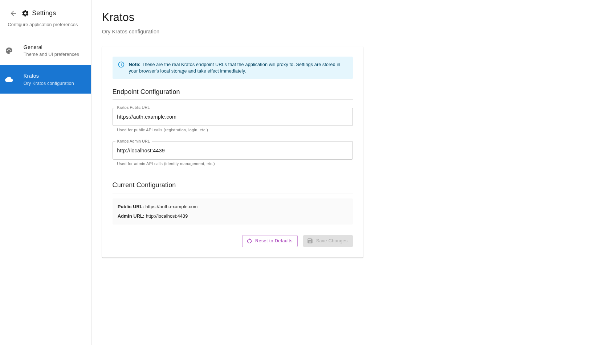

# Kratos Admin UI

A modern admin interface for [Ory Kratos](https://www.ory.sh/kratos/) identity management and [Ory Hydra](https://www.ory.sh/hydra/) OAuth2 server. Built with Next.js 16, TypeScript, and custom UI components.

## Live Demo

[https://admin.ory.cloud-ctl.com](https://admin.ory.cloud-ctl.com)

**Security Notice**: This interface uses mock authentication for development purposes and should not be exposed to the public internet. Deploy behind proper authentication and access controls in production environments.

**Development Status**: This project is in active development. Features may change and breaking updates can occur.

## Features

### Kratos Identity Management

- **Dashboard**: Analytics with user growth, active sessions, verification rates, and system health metrics
- **Identities**: Create, view, edit, and delete identities with schema-based forms and metadata management
- **Sessions**: Monitor, extend, and revoke sessions with advanced search and filtering
- **Messages**: Track email/SMS courier messages with delivery status and error monitoring
- **Schemas**: View and inspect identity schemas with JSON visualization

### Hydra OAuth2 Management

- **OAuth2 Clients**: Full CRUD operations for OAuth2 clients with configuration management
- **OAuth2 Tokens**: Monitor and revoke access/refresh tokens with client-based filtering

### User Interface

- Modern custom UI with light/dark theme support
- Real-time endpoint configuration for Kratos and Hydra
- Advanced search and pagination across all data tables
- Responsive design with interactive charts and data visualization

## Screenshots

| Dashboard                            | Identities                           | Sessions                         | Messages                         |
| ------------------------------------ | ------------------------------------ | -------------------------------- | -------------------------------- |
|  |  |  |  |

| Identity Details                 | Session Details                | Schemas                        | Settings                         |
| -------------------------------- | ------------------------------ | ------------------------------ | -------------------------------- |
|  |  |  |  |

## Technology Stack

- **Framework**: Next.js 16 with App Router
- **UI**: Custom components with MUI v7, MUI X Charts/DataGrid
- **Forms**: React JSON Schema Form (RJSF)
- **State**: Zustand + TanStack Query
- **Language**: TypeScript
- **Styling**: Custom theme system, Tailwind CSS, Emotion
- **APIs**: Ory Kratos Client, Ory Hydra Client

## Prerequisites

- Node.js 22+
- Ory Kratos instance
- Ory Hydra instance (optional)

## Quick Start

### Local Development

```bash
git clone https://github.com/dhia-gharsallaoui/kratos-admin-ui.git
cd kratos-admin-ui
npm install
cp .env.example .env.local
# Edit .env.local with your Kratos and Hydra URLs
npm run dev
```

Access at [http://localhost:3000](http://localhost:3000)

Default credentials:

- Admin: `admin` / `admin123`
- Viewer: `viewer` / `viewer123`

### Docker

```bash
docker pull dhiagharsallaoui/kratos-admin-ui:latest

docker run -p 3000:3000 \
  -e KRATOS_PUBLIC_URL=http://localhost:4433 \
  -e KRATOS_ADMIN_URL=http://localhost:4434 \
  -e HYDRA_ADMIN_URL=http://localhost:4445 \
  -e HYDRA_PUBLIC_URL=http://localhost:4444 \
  dhiagharsallaoui/kratos-admin-ui:latest
```

See [`dev/`](./dev) folder for a complete Docker Compose development environment.

## Project Structure

```
src/
├── app/                 # Next.js App Router pages
│   ├── (app)/          # Protected routes (dashboard, identities, sessions, etc.)
│   └── (auth)/         # Authentication pages
├── components/         # Shared UI components
├── features/           # Feature modules (analytics, auth, identities, sessions, oauth2)
├── services/           # API services (Kratos, Hydra)
├── hooks/              # Custom React hooks
├── providers/          # React context providers
└── theme/              # Theme configuration
```

## Configuration

### Environment Variables

| Variable            | Default                 |
| ------------------- | ----------------------- |
| `KRATOS_PUBLIC_URL` | `http://localhost:4433` |
| `KRATOS_ADMIN_URL`  | `http://localhost:4434` |
| `HYDRA_ADMIN_URL`   | `http://localhost:4445` |
| `HYDRA_PUBLIC_URL`  | `http://localhost:4444` |

Endpoints can also be configured via the settings dialog in the application.

## Development

```bash
npm run dev          # Start development server
npm run build        # Build for production
npm run start        # Start production server
npm run lint         # Run ESLint
```

## Contributing

1. Fork the repository
2. Create a feature branch
3. Commit your changes
4. Push to your branch
5. Open a Pull Request

## License

MIT License - see [LICENSE](LICENSE) file for details.

## Acknowledgments

- [Ory Kratos](https://www.ory.sh/kratos/) - Identity management system
- [dfoxg/kratos-admin-ui](https://github.com/dfoxg/kratos-admin-ui) - Original inspiration
- Built with [Next.js](https://nextjs.org/), [Material-UI](https://mui.com/), and [TanStack Query](https://tanstack.com/query)
