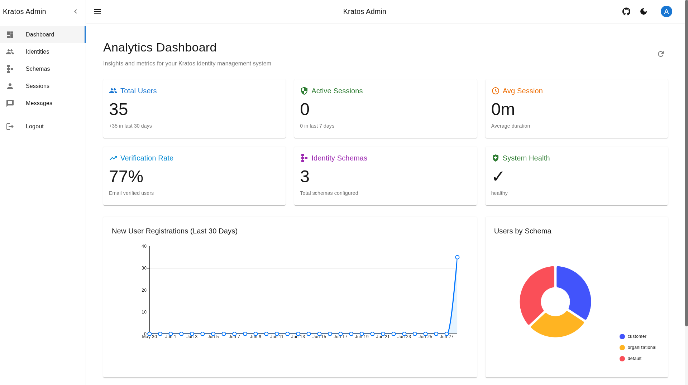
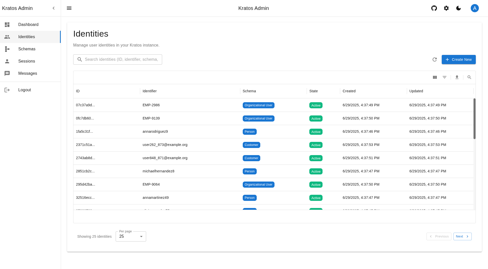
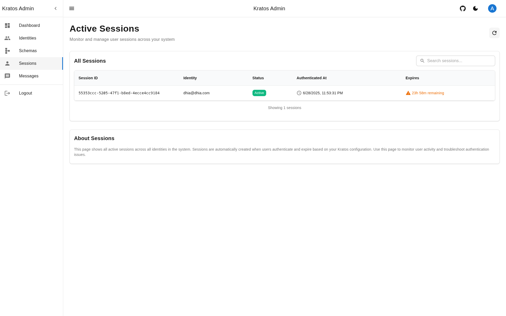
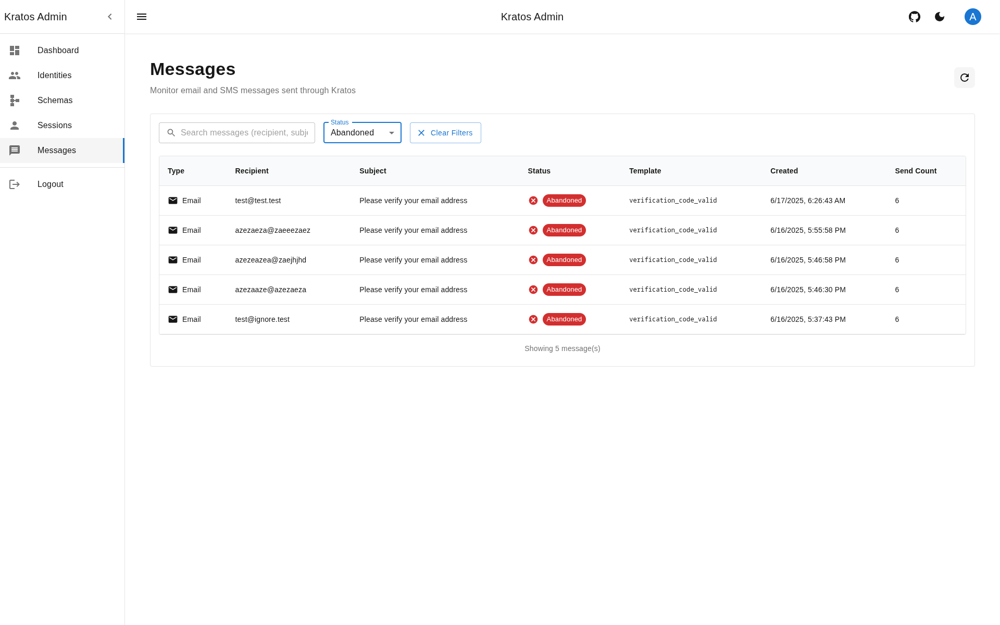
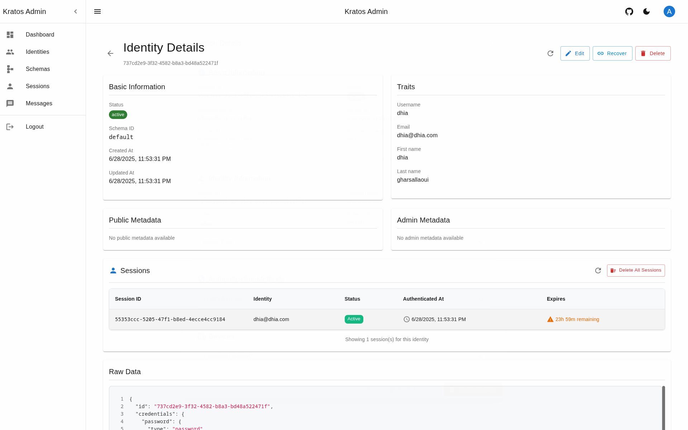
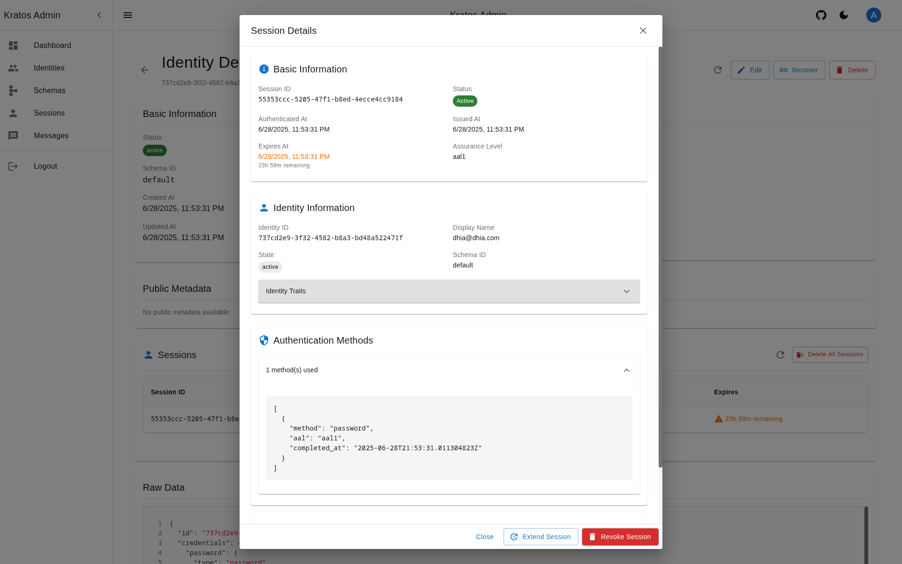
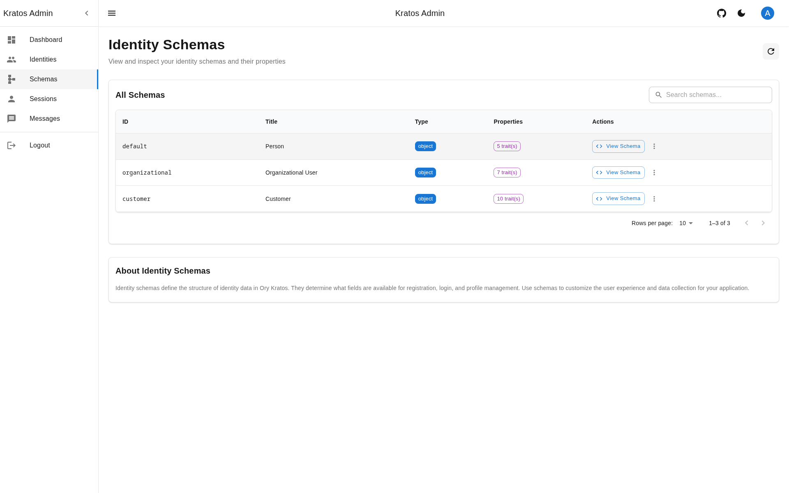
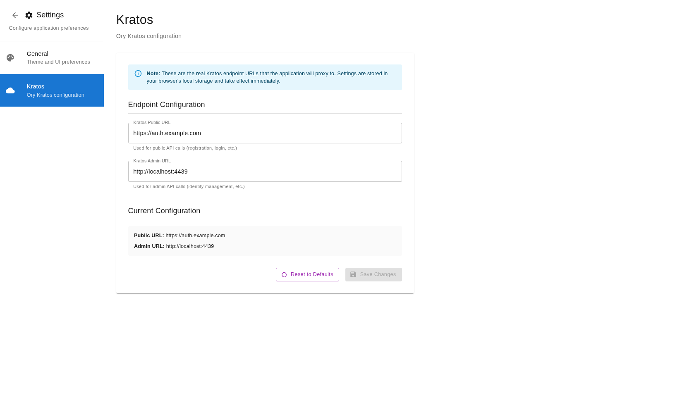

# Kratos Admin UI

A modern admin interface for [Ory Kratos](https://www.ory.sh/kratos/) identity management and [Ory Hydra](https://www.ory.sh/hydra/) OAuth2 server. Built with Next.js 16, TypeScript, and custom UI components.

## Live Demo

[https://admin.ory.cloud-ctl.com](https://admin.ory.cloud-ctl.com)

**Development Status**: This project is in active development. Features may change and breaking updates can occur.

## Features

### Kratos Identity Management

- **Dashboard**: Analytics with user growth, active sessions, verification rates, and system health metrics
- **Identities**: Create, view, edit, and delete identities with schema-based forms, credential management, and bulk operations
- **Sessions**: Monitor, extend, and revoke sessions with advanced search and filtering
- **Messages**: Track email/SMS courier messages with delivery status and error monitoring
- **Schemas**: View and inspect identity schemas with JSON visualization

### Hydra OAuth2 Management

- **OAuth2 Clients**: Full CRUD operations for OAuth2 clients with configuration management
- **OAuth2 Tokens**: Monitor and revoke access/refresh tokens with client-based filtering

### User Interface

- Modern custom UI with light/dark theme support
- Advanced search and pagination across all data tables
- Responsive design with interactive charts and data visualization

## Screenshots

| Dashboard                            | Identities                           | Sessions                         | Messages                         |
| ------------------------------------ | ------------------------------------ | -------------------------------- | -------------------------------- |
|  |  |  |  |

| Identity Details                 | Session Details                | Schemas                        | Settings                         |
| -------------------------------- | ------------------------------ | ------------------------------ | -------------------------------- |
|  |  |  |  |

## Architecture

All Ory API calls are made server-side through Next.js API Route Handlers. API keys and credentials never reach the browser.

```
Browser (React Query) --> Next.js API Routes --> Ory Kratos / Hydra
                                |
                        Server-side config
                      (env vars + JSON overrides)
```

### Project Structure

```
src/
├── api/                 # Client-side API layer (named fetch wrappers)
│   ├── kratos/          # Kratos: identities, sessions, schemas, courier, health
│   └── hydra/           # Hydra: clients, auth flows, tokens, health
├── app/
│   ├── (app)/           # Protected routes (dashboard, identities, sessions, etc.)
│   ├── (auth)/          # Login page
│   └── api/             # Server-side API Route Handlers
│       ├── auth/        # Login, logout, session validation
│       ├── kratos/      # Kratos proxy routes
│       ├── hydra/       # Hydra proxy routes
│       └── settings/    # Settings CRUD + reset
├── components/          # Shared UI components
├── features/            # Feature modules (analytics, auth, identities, sessions, oauth2)
├── services/            # Ory SDK clients (server-only, never imported by client code)
├── lib/                 # Core utilities (auth, settings store, API helpers)
├── hooks/               # Custom React hooks
├── providers/           # React context providers
└── theme/               # Theme configuration
```

## Technology Stack

- **Framework**: Next.js 16 with App Router
- **UI**: Custom components with MUI v7, MUI X Charts/DataGrid
- **Forms**: React JSON Schema Form (RJSF)
- **State**: Zustand + TanStack Query
- **Language**: TypeScript
- **Styling**: Custom theme system, Emotion
- **APIs**: Ory Kratos Client, Ory Hydra Client
- **Runtime**: Bun

## Prerequisites

- [Bun](https://bun.sh/) (or Node.js 22+)
- Ory Kratos instance (self-hosted or Ory Network)
- Ory Hydra instance (optional)

## Quick Start

### Local Development

```bash
git clone https://github.com/dhia-gharsallaoui/kratos-admin-ui.git
cd kratos-admin-ui
bun install
cp .env.example .env.local
# Edit .env.local with your configuration
bun run dev
```

Access at [http://localhost:3000](http://localhost:3000)

### Docker

```bash
docker pull dhiagharsallaoui/kratos-admin-ui:latest

docker run -p 3000:3000 \
  -e ADMIN_USERNAME=admin \
  -e ADMIN_PASSWORD=changeme \
  -e KRATOS_PUBLIC_URL=http://localhost:4433 \
  -e KRATOS_ADMIN_URL=http://localhost:4434 \
  dhiagharsallaoui/kratos-admin-ui:latest
```

See [`dev/`](./dev) folder for a complete Docker Compose development environment.

## Configuration

### Environment Variables

#### Authentication (required)

| Variable         | Default | Description                                    |
| ---------------- | ------- | ---------------------------------------------- |
| `ADMIN_USERNAME` | -       | Username for the admin UI login                |
| `ADMIN_PASSWORD` | -       | Password for the admin UI login                |
| `AUTH_DISABLED`  | `false` | Set to `true` to skip auth (for network-level security) |

#### Kratos

| Variable            | Default                 | Description                      |
| ------------------- | ----------------------- | -------------------------------- |
| `KRATOS_PUBLIC_URL`  | `http://localhost:4433` | Kratos public API endpoint       |
| `KRATOS_ADMIN_URL`   | `http://localhost:4434` | Kratos admin API endpoint        |
| `KRATOS_API_KEY`     | -                       | Bearer token for Kratos API auth |

#### Hydra (optional)

| Variable           | Default                 | Description                     |
| ------------------ | ----------------------- | ------------------------------- |
| `HYDRA_PUBLIC_URL`  | `http://localhost:4444` | Hydra public API endpoint       |
| `HYDRA_ADMIN_URL`   | `http://localhost:4445` | Hydra admin API endpoint        |
| `HYDRA_API_KEY`     | -                       | Bearer token for Hydra API auth |
| `HYDRA_ENABLED`     | `true`                  | Set to `false` to disable Hydra |

#### General

| Variable             | Default                  | Description                              |
| -------------------- | ------------------------ | ---------------------------------------- |
| `IS_ORY_NETWORK`     | `false`                  | Set to `true` for Ory Network (skips health checks) |
| `ORY_API_KEY`        | -                        | Shared API key (fallback for KRATOS/HYDRA_API_KEY)   |
| `SETTINGS_FILE_PATH` | `./data/settings.json`   | Path for runtime settings overrides      |

### Runtime Settings

URL endpoints can also be changed at runtime via the Settings page. Changes are persisted server-side in a JSON file and survive restarts. Use the "Reset to Defaults" button to revert to environment variable values.

API keys are configured exclusively via environment variables and are never exposed to the browser. The Settings page shows a "Configured" / "Not Set" indicator for each API key.

## Development

```bash
bun run dev          # Start development server
bun run build        # Build for production
bun run start        # Start production server
bun run lint         # Run Biome linter
```

## Contributing

1. Fork the repository
2. Create a feature branch
3. Commit your changes
4. Push to your branch
5. Open a Pull Request

## License

MIT License - see [LICENSE](LICENSE) file for details.

## Acknowledgments

- [Ory Kratos](https://www.ory.sh/kratos/) - Identity management system
- [dfoxg/kratos-admin-ui](https://github.com/dfoxg/kratos-admin-ui) - Original inspiration
- Built with [Next.js](https://nextjs.org/), [Material-UI](https://mui.com/), and [TanStack Query](https://tanstack.com/query)
